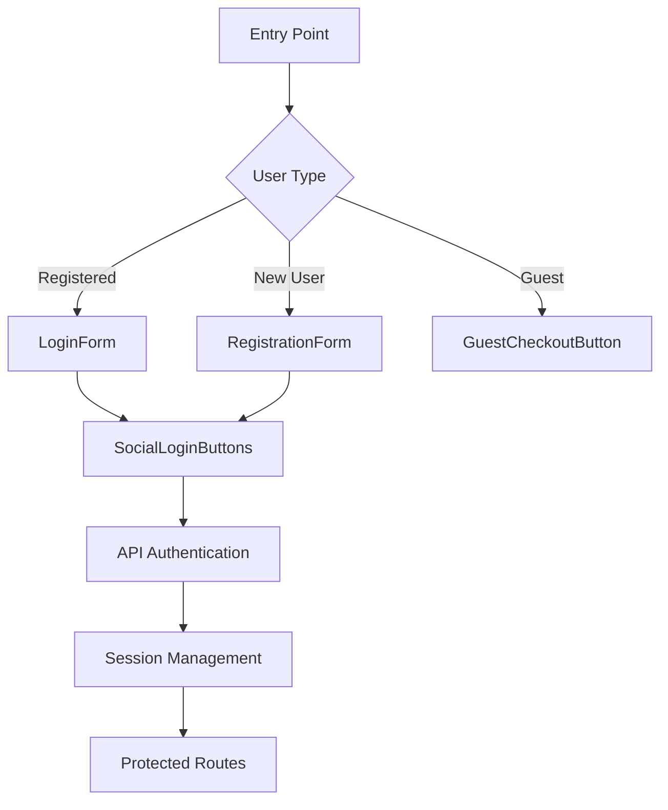

# Tacos Sinaloa Authentication Flow Documentation

## Current Implementation Analysis

### Components:
1. **RegistrationForm.tsx**
   - Basic email/password registration
   - Client-side validation only
   - Mock authentication using localStorage
   - No API integration

2. **LoginForm.tsx** 
   - Validates against mock localStorage data
   - No session management
   - No error handling for API failures

3. **GuestCheckoutButton.tsx**
   - Simple guest session creation
   - Uses localStorage for session ID
   - No connection to auth state

4. **SocialLoginButtons.tsx**
   - Google and Facebook OAuth mock implementation
   - Test credentials only
   - Requires parent component callbacks

### Limitations:
- No centralized state management
- No proper session persistence
- No API integration
- No error handling
- No loading states

## Proposed Authentication Flow



## State Management Approach

1. **Auth Context Provider**
   - Wrap application with AuthProvider
   - Manage user state and session
   - Provide auth methods via context

2. **Auth Reducer**
   - Handle login/logout/register actions
   - Manage loading/error states
   - Persist session

## Session Persistence Strategy

1. **Server-side Sessions**
   - JWT tokens for API authentication
   - HttpOnly cookies for security
   - Refresh token rotation

2. **Client-side Storage**
   - Encrypted session storage
   - Automatic token refresh
   - Session timeout handling

## Directory Structure

```
src/features/auth/
├── components/          # Presentational components
│   ├── LoginForm.tsx
│   ├── RegistrationForm.tsx
│   ├── SocialLoginButtons.tsx
│   └── GuestCheckoutButton.tsx
├── context/             # State management
│   ├── AuthContext.tsx
│   └── AuthReducer.ts
├── hooks/               # Custom hooks
│   ├── useAuth.ts
│   └── useSession.ts
├── api/                 # API integration
│   ├── authAPI.ts
│   └── types.ts
├── utils/               # Helpers
│   ├── authUtils.ts
│   └── storage.ts
└── index.ts             # Public exports
```

## Future Improvements

1. **API Integration**
   - Connect to backend auth service
   - Proper error handling
   - Loading states

2. **Enhanced Security**
   - CSRF protection
   - Rate limiting
   - Password strength requirements

3. **Additional Features**
   - Password reset flow
   - Email verification
   - 2FA support

## Required Dependencies

1. **State Management**
   - react-context (already in project)
   - @reduxjs/toolkit (optional)

2. **Security**
   - jsonwebtoken
   - crypto-js

3. **OAuth**
   - @react-oauth/google
   - react-facebook-login

4. **Testing**
   - @testing-library/react
   - msw (mock service worker)