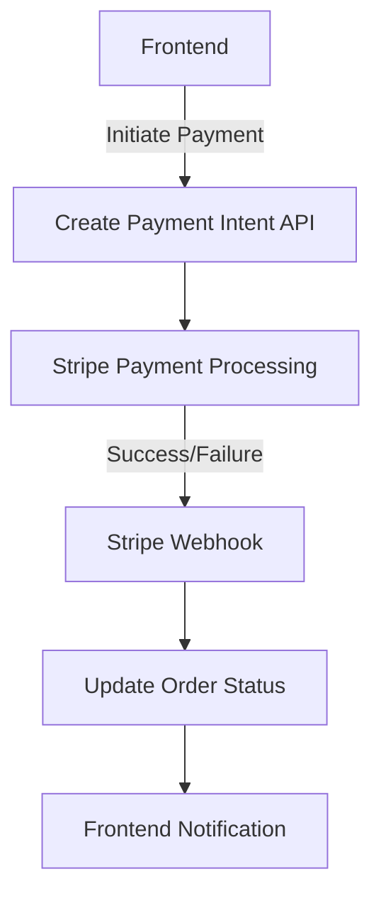

# Payment Confirmation System Documentation

## 1. System Architecture

### Payment Flow Diagram


### Component Relationships
- **Frontend**: 
  - Initiates payment via API call to `/api/create-payment-intent`
  - Handles payment confirmation UI
- **Backend**:
  - `create-payment-intent.ts`: Creates Stripe PaymentIntent
  - `webhooks.ts`: Processes Stripe webhook events
- **Stripe**:
  - Processes payments
  - Sends payment status events via webhooks

### Security Considerations
- All requests must use HTTPS
- Webhook signature verification
- Sensitive keys stored in environment variables:
  - `STRIPE_SECRET_KEY`
  - `STRIPE_WEBHOOK_SECRET`
- Minimum payment amount validation ($0.50)

## 2. Implementation Guide

### Backend Setup
1. Install Stripe SDK:
```bash
npm install stripe
```

2. Configure API routes:
- `pages/api/create-payment-intent.ts`
- `pages/api/webhooks.ts`

3. Required environment variables:
```env
STRIPE_SECRET_KEY=sk_test_...
STRIPE_WEBHOOK_SECRET=whsec_...
```

### Frontend Integration
1. Load Stripe.js:
```html
<script src="https://js.stripe.com/v3/"></script>
```

2. Create payment intent:
```javascript
fetch('/api/create-payment-intent', {
  method: 'POST',
  headers: { 'Content-Type': 'application/json' },
  body: JSON.stringify({ amount: 1000 }) // $10.00
})
```

3. Handle payment confirmation:
```javascript
stripe.confirmPayment({ clientSecret, /* ... */ });
```

## 3. Testing Documentation

### Automated Tests
- Unit tests: `paymentService.test.ts`
- Integration tests: 
  - `create-payment-intent.test.ts`
  - `webhooks.test.ts`
- E2E tests: `payment.e2e.test.ts`

### Test Cards
| Scenario | Test Card |
|----------|-----------|
| Success | 4242424242424242 |
| Declined | 4000000000000002 |
| 3D Secure | 4000002500003155 |

### Webhook Testing
```bash
stripe listen --forward-to localhost:3000/api/webhooks
stripe trigger payment_intent.succeeded
```

## 4. Deployment Checklist

### Production Setup
1. Replace test keys with live keys
2. Configure webhook endpoint in Stripe Dashboard
3. Set up monitoring for:
   - Failed payments
   - Webhook delivery failures

### Error Handling
- Log all payment failures
- Retry failed webhook deliveries
- Alert on critical failures

## 5. Maintenance Guide

### Troubleshooting
- **Payment failures**: Check Stripe logs
- **Webhook issues**: Verify signature
- **API errors**: Validate request data

### Upgrades
1. Check Stripe API changelog
2. Test with new API version
3. Update `apiVersion` in code

### Optimization
- Cache frequently used data
- Batch update operations
- Monitor performance metrics